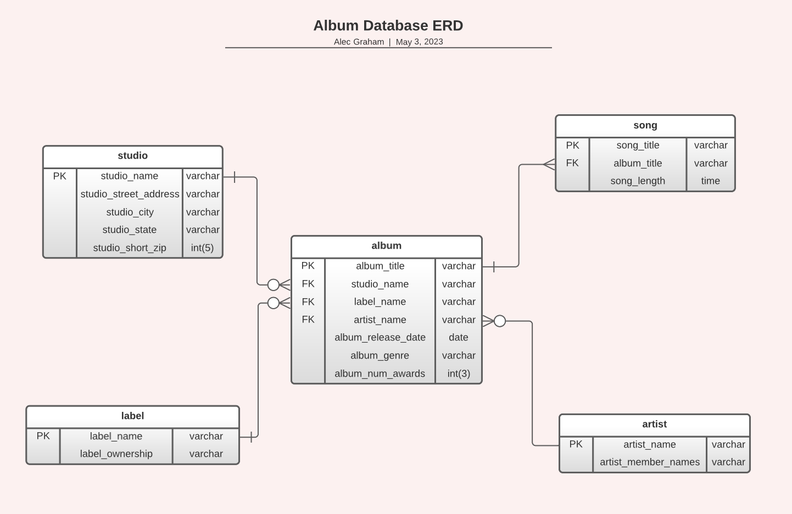

# DBA 120 Final Project

## ERD for the MusicLib Database



## How To Create the Database

[dba_final.sql](dba_final.sql)

```
-- create db

CREATE DATABASE MusicLib;

USE MusicLib;

-- create tables

CREATE TABLE album (
  album_title VARCHAR(255) NOT NULL,
  studio_name VARCHAR(255),
  label_name VARCHAR(255),
  artist_name VARCHAR(255),
  album_release_date DATE,
  album_genre VARCHAR(255),
  album_num_awards INT(3),
  PRIMARY KEY (album_title)
);

CREATE TABLE artist (
  artist_name VARCHAR(255) NOT NULL,
  artist_member_names VARCHAR(255),
  PRIMARY KEY (artist_name)
);

CREATE TABLE label (
  label_name VARCHAR(255) NOT NULL,
  label_ownership VARCHAR(255),
  PRIMARY KEY (label_name)
);

CREATE TABLE song (
  song_title VARCHAR(255) NOT NULL,
  album_title VARCHAR(255),
  song_length TIME,
  PRIMARY KEY (song_title)
);

CREATE TABLE studio (
  studio_name VARCHAR(255) NOT NULL,
  studio_street_address VARCHAR(255),
  studio_city VARCHAR(255),
  studio_state VARCHAR(255),
  studio_short_zip INT(5),
  PRIMARY KEY (studio_name)
);

-- add foreign keys

ALTER TABLE album
  ADD FOREIGN KEY (studio_name) REFERENCES studio(studio_name),
  ADD FOREIGN KEY (label_name) REFERENCES label(label_name),
  ADD FOREIGN KEY (artist_name) REFERENCES artist(artist_name);

ALTER TABLE song
  ADD FOREIGN KEY (album_title) REFERENCES album(album_title);

```

## How to inject data to the MusicLib database

```

-- labels

INSERT INTO label (label_name, label_ownership) VALUES ('ABC Records', 'Sony');
INSERT INTO label (label_name, label_ownership) VALUES ('CAB Records', 'Microsoft');
INSERT INTO label (label_name, label_ownership) VALUES ('CBA Records', 'Nintendo');

-- studios

INSERT INTO studio (studio_name, studio_street_address, studio_city, studio_state, studio_short_zip) VALUES ('QWERTY Studios', '21309 Oak Drive', 'Los Angeles', 'CA', '10203');
INSERT INTO studio (studio_name, studio_street_address, studio_city, studio_state, studio_short_zip) VALUES ('Elephant Studios', '57 Cedar Street', 'Boston', 'MA', '12345');
INSERT INTO studio (studio_name, studio_street_address, studio_city, studio_state, studio_short_zip) VALUES ('WASD Studios', '101 Dogwood Lane', 'Milwaukee', 'WI', '21234');

-- artists

INSERT INTO artist (artist_name, artist_member_names) VALUES ('Bob and the Boys', 'Bob, Charlie, Jerry');
INSERT INTO artist (artist_name, artist_member_names) VALUES ('Red Swan', 'Tito, Timo, Oteen');
INSERT INTO artist (artist_name, artist_member_names) VALUES ('Mr. Crocodile', 'Kyle, Jeff');
INSERT INTO artist (artist_name, artist_member_names) VALUES ('Gandalf the Grey', 'Gandalf');
INSERT INTO artist (artist_name, artist_member_names) VALUES ('Beastie Boys', 'Mike D, MCA, Ad-Rock');
INSERT INTO artist (artist_name, artist_member_names) VALUES ('Aerosmith', 'Steven, Joey, Joe, Brad, Tom');
INSERT INTO artist (artist_name, artist_member_names) VALUES ('Tom and Jerry', 'Tom, Jerry');

-- albums

INSERT INTO album (album_title, studio_name, label_name, artist_name, album_release_date, album_genre, album_num_awards) VALUES ('Magic Touch', 'QWERTY Studios', 'ABC Records', 'Bob and the Boys', '2019-06-17', 'Rock', '0');
INSERT INTO album (album_title, studio_name, label_name, artist_name, album_release_date, album_genre, album_num_awards) VALUES ('Paradiso', 'QWERTY Studios', 'CAB Records', 'Red Swan', '2009-07-03', 'Reggae', '4');
INSERT INTO album (album_title, studio_name, label_name, artist_name, album_release_date, album_genre, album_num_awards) VALUES ('The Boat Ride', 'QWERTY Studios', 'CAB Records', 'Red Swan', '2005-03-07', 'Reggae', '6');
INSERT INTO album (album_title, studio_name, label_name, artist_name, album_release_date, album_genre, album_num_awards) VALUES ('Hoopla', 'Elephant Studios', 'ABC Records', 'Mr. Crocodile', '2000-10-22', 'Pop', '2');
INSERT INTO album (album_title, studio_name, label_name, artist_name, album_release_date, album_genre, album_num_awards) VALUES ('Jelly Fox', 'Elephant Studios', 'CBA Records', 'Gandalf the Grey', '2000-10-01', 'Pop', '2');
INSERT INTO album (album_title, studio_name, label_name, artist_name, album_release_date, album_genre, album_num_awards) VALUES ('Street Beat', 'WASD Studios', 'CBA Records', 'Beastie Boys', '1998-02-12', 'Rap', '3');
INSERT INTO album (album_title, studio_name, label_name, artist_name, album_release_date, album_genre, album_num_awards) VALUES ('Dark', 'WASD Studios', 'CAB Records', 'Aerosmith', '1982-01-13', 'Garage Rock', '7');
INSERT INTO album (album_title, studio_name, label_name, artist_name, album_release_date, album_genre, album_num_awards) VALUES ('Light', 'WASD Studios', 'CAB Records', 'Tom and Jerry', '2001-02-07', 'Funk', '1');
INSERT INTO album (album_title, studio_name, label_name, artist_name, album_release_date, album_genre, album_num_awards) VALUES ('Water', 'WASD Studios', 'CBA Records', 'Tom and Jerry', '1999-10-30', 'Jam Rock', '2');
INSERT INTO album (album_title, studio_name, label_name, artist_name, album_release_date, album_genre, album_num_awards) VALUES ('Animal House', 'WASD Studios', 'CBA Records', 'Beastie Boys', '1995-05-21', 'Rap', '0');

-- songs

INSERT INTO song (song_title, album_title, song_length) VALUES ('Sula nebouxii', 'Magic Touch', '20:01:24');
INSERT INTO song (song_title, album_title, song_length) VALUES ('Threskionis aethiopicus', 'Magic Touch', '15:26:44');
INSERT INTO song (song_title, album_title, song_length) VALUES ('Dasypus septemcincus', 'Magic Touch', '18:42:34');
INSERT INTO song (song_title, album_title, song_length) VALUES ('Crotalus triseriatus', 'Magic Touch', '19:40:31');
INSERT INTO song (song_title, album_title, song_length) VALUES ('Ciconia ciconia', 'Magic Touch', '21:19:46');
INSERT INTO song (song_title, album_title, song_length) VALUES ('Eubalaena australis', 'Magic Touch', '19:57:13');
INSERT INTO song (song_title, album_title, song_length) VALUES ('Gopherus agassizii', 'Magic Touch', '11:19:07');
INSERT INTO song (song_title, album_title, song_length) VALUES ('Perameles nasuta', 'Magic Touch', '23:38:32');
INSERT INTO song (song_title, album_title, song_length) VALUES ('Anser anser', 'Magic Touch', '4:24:12');
INSERT INTO song (song_title, album_title, song_length) VALUES ('Macropus robustus', 'Magic Touch', '8:31:09');
INSERT INTO song (song_title, album_title, song_length) VALUES ('Cyrtodactylus louisiadensis', 'Magic Touch', '16:44:06');
INSERT INTO song (song_title, album_title, song_length) VALUES ('Sarkidornis melanotos', 'Paradiso', '1:05:29');
INSERT INTO song (song_title, album_title, song_length) VALUES ('Odocoileus hemionus', 'Paradiso', '1:28:18');
INSERT INTO song (song_title, album_title, song_length) VALUES ('Carphophis sp.', 'Paradiso', '7:55:49');
INSERT INTO song (song_title, album_title, song_length) VALUES ('Larus dominicanus', 'Paradiso', '16:39:50');
INSERT INTO song (song_title, album_title, song_length) VALUES ('Alligator mississippiensis', 'Paradiso', '15:40:37');
INSERT INTO song (song_title, album_title, song_length) VALUES ('Taxidea taxus', 'Paradiso', '17:26:31');
INSERT INTO song (song_title, album_title, song_length) VALUES ('Dasypus novemcinctus', 'Paradiso', '0:11:27');
INSERT INTO song (song_title, album_title, song_length) VALUES ('Spermophilus parryii', 'Paradiso', '21:28:14');
INSERT INTO song (song_title, album_title, song_length) VALUES ('Trachyphonus vaillantii', 'Paradiso', '3:48:33');
INSERT INTO song (song_title, album_title, song_length) VALUES ('Pseudilopex gymnocercus', 'The Boat Ride', '10:07:43');
INSERT INTO song (song_title, album_title, song_length) VALUES ('Agouti paca', 'The Boat Ride', '1:49:23');
INSERT INTO song (song_title, album_title, song_length) VALUES ('Hyaena brunnea', 'The Boat Ride', '10:44:26');
INSERT INTO song (song_title, album_title, song_length) VALUES ('Egretto thulo', 'The Boat Ride', '18:11:47');
INSERT INTO song (song_title, album_title, song_length) VALUES ('Phascogale calura', 'The Boat Ride', '17:38:16');
INSERT INTO song (song_title, album_title, song_length) VALUES ('Phalacrocorax niger', 'Hoopla', '19:17:24');
INSERT INTO song (song_title, album_title, song_length) VALUES ('Agelaius phoeniceus', 'Hoopla', '18:42:45');
INSERT INTO song (song_title, album_title, song_length) VALUES ('Felis concolor', 'Hoopla', '15:14:25');
INSERT INTO song (song_title, album_title, song_length) VALUES ('Colobus guerza', 'Hoopla', '3:42:15');
INSERT INTO song (song_title, album_title, song_length) VALUES ('Rhea americana', 'Hoopla', '21:46:52');
INSERT INTO song (song_title, album_title, song_length) VALUES ('Dromeus novaehollandiae', 'Hoopla', '16:07:15');
INSERT INTO song (song_title, album_title, song_length) VALUES ('Fregata magnificans', 'Hoopla', '11:31:10');
INSERT INTO song (song_title, album_title, song_length) VALUES ('Procyon cancrivorus', 'Hoopla', '22:40:31');
INSERT INTO song (song_title, album_title, song_length) VALUES ('Mephitis mephitis', 'Hoopla', '11:16:27');
INSERT INTO song (song_title, album_title, song_length) VALUES ('Aonyx capensis', 'Hoopla', '7:49:27');
INSERT INTO song (song_title, album_title, song_length) VALUES ('Cercatetus concinnus', 'Hoopla', '8:46:20');
INSERT INTO song (song_title, album_title, song_length) VALUES ('Pseudoleistes virescens', 'Hoopla', '1:35:04');
INSERT INTO song (song_title, album_title, song_length) VALUES ('Lasiadoro parahybana', 'Hoopla', '13:48:24');
INSERT INTO song (song_title, album_title, song_length) VALUES ('Speothos vanaticus', 'Jelly Fox', '5:09:30');
INSERT INTO song (song_title, album_title, song_length) VALUES ('Melursus ursinus', 'Jelly Fox', '9:12:14');
INSERT INTO song (song_title, album_title, song_length) VALUES ('Gazella thompsonii', 'Jelly Fox', '14:45:32');
INSERT INTO song (song_title, album_title, song_length) VALUES ('Egretta thula', 'Jelly Fox', '16:20:40');
INSERT INTO song (song_title, album_title, song_length) VALUES ('Bradypus tridactylus', 'Jelly Fox', '7:19:24');
INSERT INTO song (song_title, album_title, song_length) VALUES ('Heloderma horridum', 'Jelly Fox', '22:52:40');
INSERT INTO song (song_title, album_title, song_length) VALUES ('Ardea golieth', 'Jelly Fox', '14:23:49');
INSERT INTO song (song_title, album_title, song_length) VALUES ('Tomeo scincoides', 'Jelly Fox', '9:35:58');
INSERT INTO song (song_title, album_title, song_length) VALUES ('Larus sp.', 'Jelly Fox', '5:06:43');
INSERT INTO song (song_title, album_title, song_length) VALUES ('Lasiodora parahybana', 'Jelly Fox', '14:46:12');
INSERT INTO song (song_title, album_title, song_length) VALUES ('Psittacula krameri', 'Street Beat', '18:49:40');
INSERT INTO song (song_title, album_title, song_length) VALUES ('Graspus graspus', 'Street Beat', '11:58:26');
INSERT INTO song (song_title, album_title, song_length) VALUES ('Aegypius occipitalis', 'Street Beat', '12:50:36');
INSERT INTO song (song_title, album_title, song_length) VALUES ('Varanus salvator', 'Street Beat', '2:40:57');
INSERT INTO song (song_title, album_title, song_length) VALUES ('Porphyrio porphyrio', 'Street Beat', '3:22:19');
INSERT INTO song (song_title, album_title, song_length) VALUES ('Junonia genoveua', 'Street Beat', '19:50:30');
INSERT INTO song (song_title, album_title, song_length) VALUES ('Mazama gouazoubira', 'Street Beat', '1:23:40');
INSERT INTO song (song_title, album_title, song_length) VALUES ('Pycnonotus nigricans', 'Street Beat', '18:33:51');
INSERT INTO song (song_title, album_title, song_length) VALUES ('Manouria emys', 'Street Beat', '14:35:43');
INSERT INTO song (song_title, album_title, song_length) VALUES ('Ateles paniscus', 'Street Beat', '20:05:56');
INSERT INTO song (song_title, album_title, song_length) VALUES ('Varanus komodensis', 'Street Beat', '22:29:51');
INSERT INTO song (song_title, album_title, song_length) VALUES ('Larus novaehollandiae', 'Dark', '13:02:43');
INSERT INTO song (song_title, album_title, song_length) VALUES ('Nucifraga columbiana', 'Dark', '9:23:32');
INSERT INTO song (song_title, album_title, song_length) VALUES ('Tofotu scincoides', 'Dark', '10:46:40');
INSERT INTO song (song_title, album_title, song_length) VALUES ('Lepus arcticus', 'Dark', '11:25:14');
INSERT INTO song (song_title, album_title, song_length) VALUES ('Falco mexicanus', 'Dark', '23:27:23');
INSERT INTO song (song_title, album_title, song_length) VALUES ('Trichoglossus chlorolepidotus', 'Dark', '23:24:33');
INSERT INTO song (song_title, album_title, song_length) VALUES ('Bos taurus', 'Dark', '8:18:43');
INSERT INTO song (song_title, album_title, song_length) VALUES ('Vulpes vulpes', 'Dark', '17:35:04');
INSERT INTO song (song_title, album_title, song_length) VALUES ('Felis silvestris lyrica', 'Dark', '14:39:13');
INSERT INTO song (song_title, album_title, song_length) VALUES ('Tiliqua scincoides', 'Dark', '11:16:36');
INSERT INTO song (song_title, album_title, song_length) VALUES ('Merops nubicus', 'Dark', '15:05:45');
INSERT INTO song (song_title, album_title, song_length) VALUES ('Tadorna tadorna', 'Dark', '18:22:25');
INSERT INTO song (song_title, album_title, song_length) VALUES ('Equus hemionus', 'Dark', '15:10:23');
INSERT INTO song (song_title, album_title, song_length) VALUES ('Alectora lathami', 'Dark', '12:11:45');
INSERT INTO song (song_title, album_title, song_length) VALUES ('Saridornis melanotos', 'Dark', '20:40:08');
INSERT INTO song (song_title, album_title, song_length) VALUES ('Paraxerus cepapi', 'Dark', '14:15:50');
INSERT INTO song (song_title, album_title, song_length) VALUES ('Dipodomys deserti', 'Light', '2:12:05');
INSERT INTO song (song_title, album_title, song_length) VALUES ('Lophoaetus occipitalis', 'Light', '19:28:48');
INSERT INTO song (song_title, album_title, song_length) VALUES ('Cyrtodactlus louisiadensis', 'Light', '4:10:47');
INSERT INTO song (song_title, album_title, song_length) VALUES ('Alopex lagopus', 'Light', '19:14:16');
INSERT INTO song (song_title, album_title, song_length) VALUES ('Orcinus orca', 'Light', '22:47:05');
INSERT INTO song (song_title, album_title, song_length) VALUES ('Lophoetus occipitalis', 'Light', '4:30:47');
INSERT INTO song (song_title, album_title, song_length) VALUES ('Papio ursinus', 'Light', '15:45:44');
INSERT INTO song (song_title, album_title, song_length) VALUES ('Hystrix indica', 'Water', '8:44:19');
INSERT INTO song (song_title, album_title, song_length) VALUES ('Dasyurus viverrinus', 'Water', '19:36:46');
INSERT INTO song (song_title, album_title, song_length) VALUES ('Ephippiorhynchus mycteria', 'Water', '19:39:14');
INSERT INTO song (song_title, album_title, song_length) VALUES ('Leptoptilos crumeniferus', 'Water', '22:23:56');
INSERT INTO song (song_title, album_title, song_length) VALUES ('Alectura lathami', 'Water', '17:14:53');
INSERT INTO song (song_title, album_title, song_length) VALUES ('Ninox superciliaris', 'Water', '12:10:42');
INSERT INTO song (song_title, album_title, song_length) VALUES ('Canis dingo', 'Water', '10:18:35');
INSERT INTO song (song_title, album_title, song_length) VALUES ('Lamprotornis nitens', 'Water', '2:10:10');
INSERT INTO song (song_title, album_title, song_length) VALUES ('Hydrochoerus hydrochaeris', 'Water', '5:04:57');
INSERT INTO song (song_title, album_title, song_length) VALUES ('Hyaena hyaena', 'Water', '14:15:58');
INSERT INTO song (song_title, album_title, song_length) VALUES ('Diomedea irrorata', 'Animal House', '22:41:47');
INSERT INTO song (song_title, album_title, song_length) VALUES ('Haliaetus leucoryphus', 'Animal House', '7:51:53');
INSERT INTO song (song_title, album_title, song_length) VALUES ('Felis silvestris lybica', 'Animal House', '0:16:36');
INSERT INTO song (song_title, album_title, song_length) VALUES ('Dromaeus novaehollandiae', 'Animal House', '17:09:57');
INSERT INTO song (song_title, album_title, song_length) VALUES ('Macaca nemestrina', 'Animal House', '14:43:06');
INSERT INTO song (song_title, album_title, song_length) VALUES ('Curtodactypus louisiadensis', 'Animal House', '15:14:20');
INSERT INTO song (song_title, album_title, song_length) VALUES ('Pseudalopex gymnocercus', 'Animal House', '20:14:50');
INSERT INTO song (song_title, album_title, song_length) VALUES ('Corvus albicollis', 'Animal House', '4:19:59');


```
